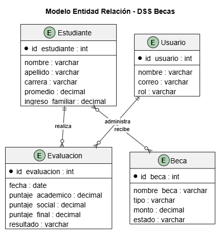

# Diseño de Base de Datos DSS-Becas

Esta carpeta contiene la documentación del modelo de datos del sistema DSS-Becas.

## Entidades principales

### Estudiante

Almacena información del estudiante:

- Código estudiante
- Nombre
- Carrera
- Datos académicos
- Información socioeconómica

### Evaluación

Registra los resultados obtenidos durante el proceso DSS.

Atributos:

- ID evaluación
- Puntaje académico
- Puntaje socioeconómico
- Puntaje final

### Beca

Gestiona la información relacionada con las becas disponibles.

Atributos:

- Código beca
- Tipo de beca
- Estado
- Beneficiario

### Usuario

Administra los accesos al sistema.

## Relaciones principales

- Un estudiante puede tener múltiples evaluaciones.
- Una evaluación genera un resultado DSS.
- Una beca puede ser asignada a estudiantes según los criterios definidos.
## Modelo Entidad Relación

El modelo entidad relación representa la estructura de datos principal del sistema DSS-Becas.

Incluye las entidades:

- Estudiante
- Evaluación
- Beca
- Usuario

y sus relaciones dentro del proceso de asignación y seguimiento de becas.

