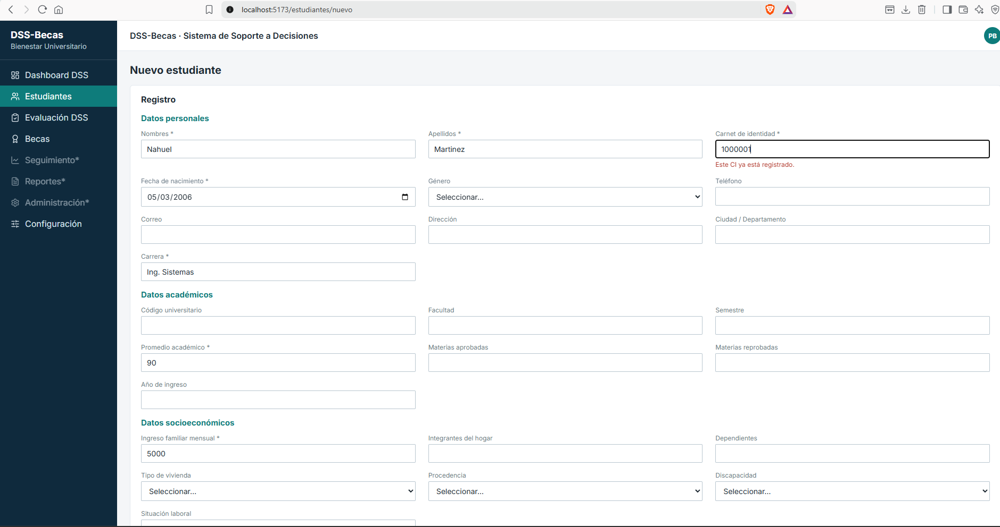
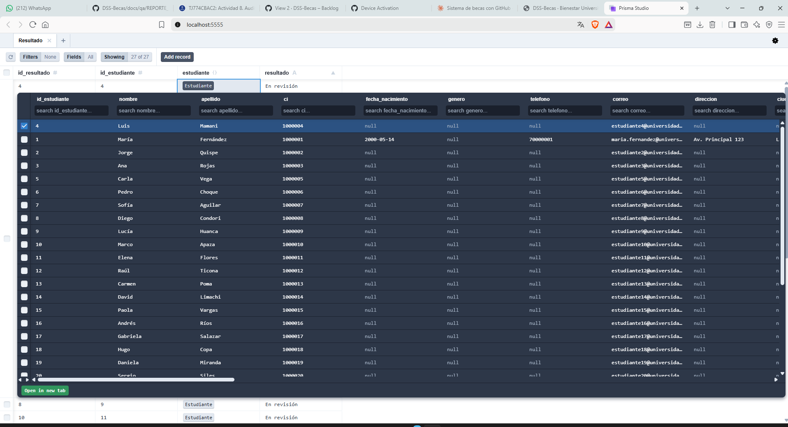
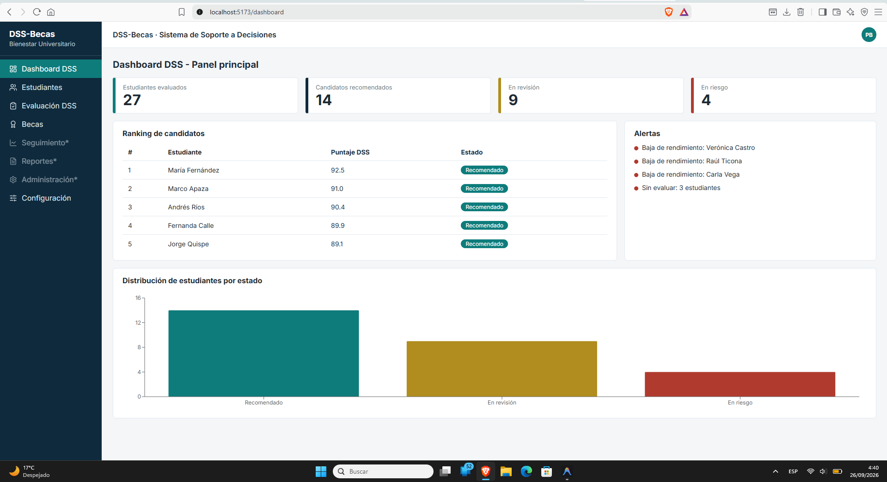
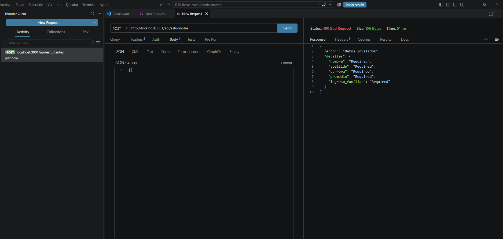
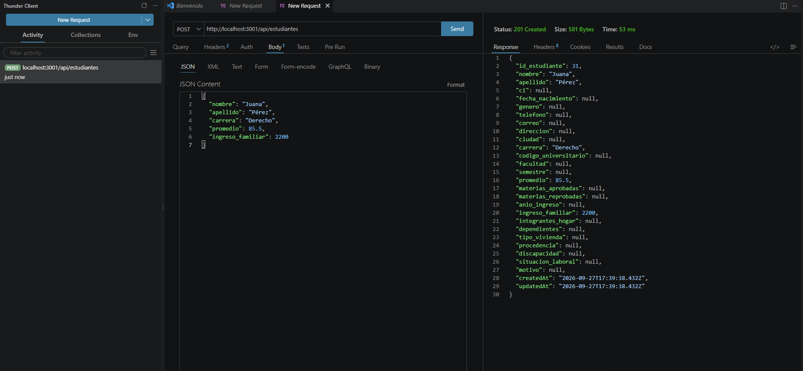
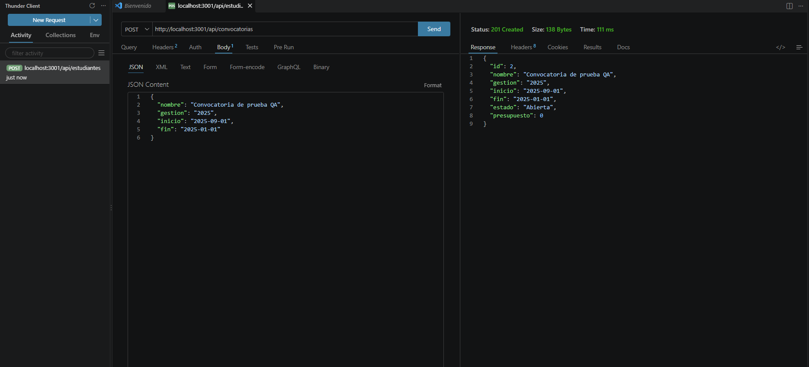
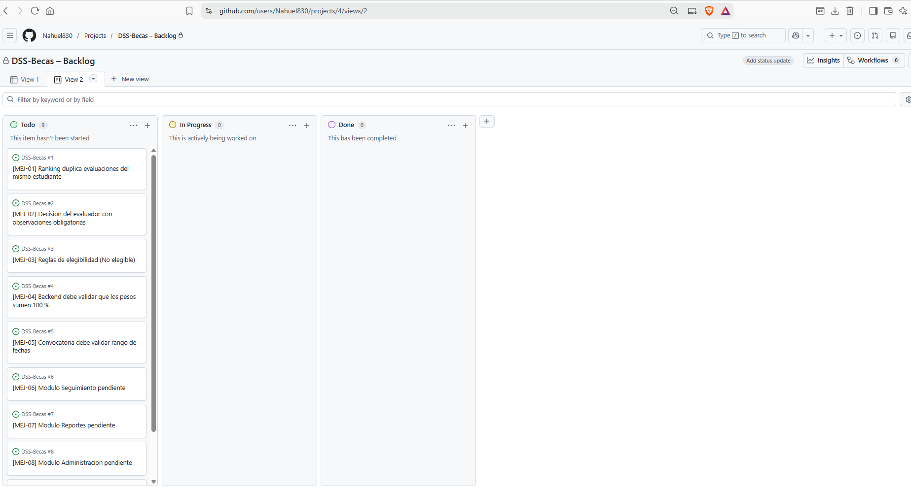
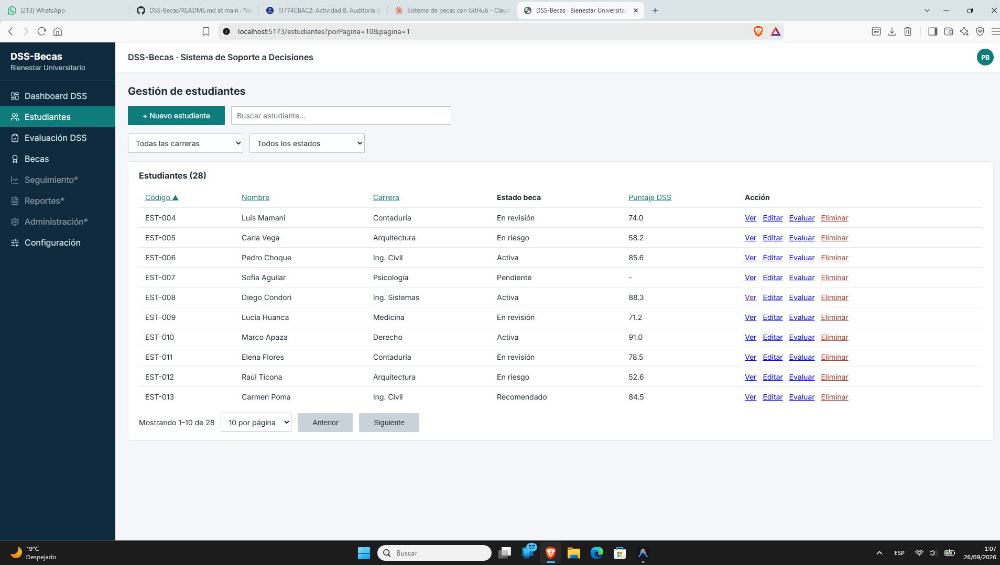

# Reporte de Pruebas QA — DSS-Becas

> Tablero GitHub Projects: https://github.com/users/Nahuel830/projects/4 ("DSS-Becas – Backlog", columna Backlog). Issues #1–#9 ya creados.

Proyecto: DSS-Becas — Sistema de Soporte a Decisiones para Asignación de Becas | Squad: [COMPLETAR] | Sprint Auditado: Sprint [COMPLETAR] – Release MVP | Fecha de Ejecución: 26/09/2026.

## 1. Alcance de las Pruebas

Auditoría funcional y UX del sistema completo (frontend React + backend Express/Prisma/SQLite) intentando romperlo con datos inválidos, límites, integridad y reglas DSS. Nota de trazabilidad: `docs/requirements` no contiene historias HU-xx, solo RF-xx/RNF-xx; los casos se vinculan a RF-xx.

Módulos Evaluados: Estudiantes (CRUD), Evaluaciones y motor DSS, Asignaciones, Dashboard, Catálogos, Documentos, API/integración.
Herramientas Utilizadas: Vitest, Supertest, Prisma Studio, Postman/Thunder Client, pruebas manuales UI, Node (contrastes WCAG).

## 2. Matriz de Casos de Prueba

### Casos críticos (primero)

| ID Test | ID Historia | Descripción (Escenario) | Pasos | Resultado Esperado | Resultado Obtenido | Estado | Evidencia |
|---------|-------------|-------------------------|-------|--------------------|--------------------|--------|-----------|
| CP-17 | RF-07 (sin HU) | Rechazar evaluación sin observaciones debe bloquearse | 1. Crear estudiante, evaluación y asignación. 2. PUT `/api/asignaciones/:id` `{estado:"Rechazada"}` sin observaciones | 400 (observaciones obligatorias) | ✅ 400 con detalle en `observaciones` (corregido en cierre) | ✅ Pasa | Anexo 4 |
| CP-15 | RF-06 (sin HU) | Promedio bajo debe dar "No elegible" | 1. POST `/api/evaluaciones/calcular` con criterios en 10 | Respuesta con elegibilidad negativa | ✅ `elegible:false` + motivos + "No elegible" (corregido en cierre) | ✅ Pasa | Anexo 4 |
| CP-13 | RF-03/04/05 (sin HU) | Pesos que suman 110 deben rechazarse en backend | 1. POST `/api/criterios` `{nombre, peso:110}` | 400 | ✅ 400 (corregido en cierre) | ✅ Pasa | Anexo 4 |
| CP-05 | RF-01 (sin HU) | Convocatoria con fin anterior al inicio | 1. POST `/api/convocatorias` `{inicio:"2025-09-01", fin:"2025-01-01"}` | 400 | ✅ 400 con error en `fin` (corregido en cierre; evidencia del fallo original: `captura3_error_fechas.png`) | ✅ Pasa | Anexo 4 |
| CP-18 | RF-08 (sin HU) | Dashboard con base vacía | 1. Vaciar tablas. 2. GET `/api/dashboard/resumen` | Ceros y listas vacías, sin NaN | `evaluados:0`, `ranking:[]`, todo finito | ✅ Pasa | Anexo 3 |

### Resto de casos

| ID Test | ID Historia | Descripción | Pasos | Esperado | Obtenido | Estado | Evidencia |
|---------|-------------|-------------|-------|----------|----------|--------|-----------|
| CP-01 | RF-01 | Obligatorios vacíos | POST `/api/estudiantes` `{}` | 400 + detalles nombre/carrera/promedio/ingreso | 400 con detalles en español | ✅ | Anexo 4 (`error_400.json`) |
| CP-02 | RF-01 | Letras en numéricos | POST con promedio "abc", ingreso "mil", semestre "tres" | 400 (3/3) | 400 (3/3) | ✅ | Anexo 4 y 6 |
| CP-03 | RF-01 | Negativos y cero | ingreso -500, integrantes 0, cupos -1, monto negativo | 400 (4/4) | 400 (4/4) | ✅ | Anexo 4 y 6 |
| CP-04 | RF-01 | Límites y edades | promedio 100.01/-1, semestre 0/11, edad 15/61 → 400; edad 20 → 201 | Según lo indicado | Según lo indicado | ✅ | Anexo 4 |
| CP-06 | RF-01 | CI/correo duplicados | Crear, reintentar igual CI y luego igual correo | 409 "Ya existe…CI/correo" | 409 en español (2/2) | ✅ | Anexo 1 (`captura1_error_ci.png`, `error_409.json`) |
| CP-07 | RF-01 | Largos y ñ/acentos | nombre 500 → 400; motivo 5000 → 201; "Ñandú Pérez O'Connor" → 201 intacto | Según lo indicado | Según lo indicado | ✅ | Anexo 2 (`captura2_prisma_studio.png`) |
| CP-08 | RF-07 | Eliminar tipo/convocatoria con asignaciones | Generar asignación, DELETE tipo y convocatoria | 409 (2/2) | 409 (2/2) | ✅ | Anexo 4 |
| CP-09 | RF-01 | Id inexistente | GET/PUT/DELETE `/api/estudiantes/999999` | 404 (3/3) | 404 (3/3) | ✅ | Anexo 4 (`error_404.json`) |
| CP-10 | RF-01 | Decimales y ñ exactos | POST promedio 78.55, ingreso 3500.75; GET | Valores exactos | Exactos, sin truncar | ✅ | Anexo 2 (`captura2_prisma_studio.png`) |
| CP-11 | RF-02 | Edición persiste | PUT promedio 91.25; GET | 91.25 | 91.25 | ✅ | Anexo 2 (`captura2_prisma_studio.png`) |
| CP-12 | RF-01 | Baja sin huérfanos | Crear + evaluar + DELETE; contar en base | 204 y ceros | 204 y ceros | ✅ | Anexo 2 (`captura2_prisma_studio.png`) |
| CP-14 | RF-03/04/05 | Cálculo a mano vs motor | criterios 90/80/70/60/50 → 73.0 "En revisión"; todo 100 → 100 | Coincide | Coincide (73.0/100) | ✅ | Anexo 4 |
| CP-16 | RF-07 | Cupos y presupuesto | Tipo cupos=1 + 2 candidatos; generar; resumen | generadas≤1, usado≤total | 1, dentro de límites | ✅ | Anexo 3 (`captura3_dashboard.png`) |
| CP-19 | RF-08 | Totales vs base | GET resumen vs `count()` Prisma | Iguales | Iguales | ✅ | Anexo 3 (`captura3_dashboard.png`, `dashboard_resumen.json`) |
| CP-20 | RNF-02 | POST válido | POST estudiante válido | 201 + id | 201 + id | ✅ | Anexo 4 (`ok_201.json`) |

Resultado: 20 ✅ Pasa, 0 ❌ Falla (cierre: los 4 fallos originales se corrigieron y verificaron). Salida completa en `docs/qa/evidencias/ejecucion_pruebas.txt` y `ejecucion_pruebas_v2.txt`.

## 3. Resumen de Defectos

| ID Test | Problema (Bug) | Issue GitHub | Prioridad | Asignado a |
|---------|----------------|--------------|-----------|------------|
| CP-17 | Sin decisión del evaluador (aprobar/rechazar/observación) | #2 | Alta | [COMPLETAR] |
| CP-15 | Sin reglas de elegibilidad ("No elegible") | #3 | Alta | [COMPLETAR] |
| CP-13 | Backend no valida que los pesos sumen 100 % | #4 | Alta | [COMPLETAR] |
| CP-05 | Convocatoria acepta fin anterior al inicio | #5 | Media | [COMPLETAR] |
| hallazgo-1 | Ranking duplica evaluaciones del mismo estudiante | #1 | Alta | [COMPLETAR] |

## 4. Anexos (evidencias)

### Anexo 1 — Error por CI duplicado (CP-06)

Formulario `/estudiantes/nuevo` con CI `1000001` existente: se observa el mensaje "Este CI ya está registrado" en rojo debajo del campo. Caso CP-06. Existe una toma duplicada (`captura1_error_ci_duplicado.png`) con el mismo contenido.

### Anexo 2 — Dato persistido en Prisma Studio (CP-07, CP-10, CP-11, CP-12)

Tablas Estudiante y Resultado en Prisma Studio: se observan 27+ filas con CI, correos y resultados ("En revisión"), sin truncamientos. Casos CP-07/CP-10/CP-11/CP-12.

### Anexo 3 — Dashboard (CP-18, CP-19, CP-16)

`/dashboard` con datos semilla: KPI 27/14/9/4, ranking top 5 con badges, 4 alertas y barras por estado. Casos CP-16/CP-18/CP-19 (existe duplicada `captura3_dashboard_duplicado.png`). JSON equivalente en `evidencias/dashboard_resumen.json`.

### Anexo 4 — Respuestas API (CP-01, CP-09, CP-20 y ex-fallos CP-05/CP-13/CP-15/CP-17)

Thunder Client POST `/api/estudiantes` con cuerpo inválido: se observa el 400 con `detalles` por campo. Casos CP-01/CP-02/CP-03.

Thunder Client POST válido: se observa el 201 con el registro creado. Caso CP-20. JSON equivalentes en `error_400.json`, `error_404.json`, `error_409.json`, `ok_201.json`.

Evidencia histórica del fallo CP-05: Thunder Client POST `/api/convocatorias` con fin (`2025-01-01`) anterior al inicio (`2025-09-01`) devolvía **201 Created**. Tras la corrección devuelve 400 con error en `fin`.

### Anexo 5 — Tablero GitHub Projects (trazabilidad)

Tablero "DSS-Becas – Backlog" con los 9 issues (#1–#9). Vista secundaria de configuración de columnas en `captura5_github_projects_vista.png`.

### Anexo 6 — Gestión de estudiantes (CP-02, CP-03)

`/estudiantes?porPagina=10&pagina=1` con 28 filas: se observan columnas Código/Nombre/Carrera/Estado beca/Puntaje DSS/Acción, buscador, filtros y paginación "Mostrando 1–10 de 28". Complementa CP-02/CP-03.
